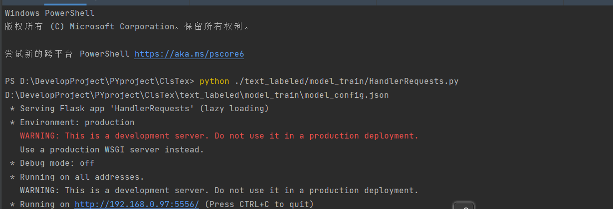
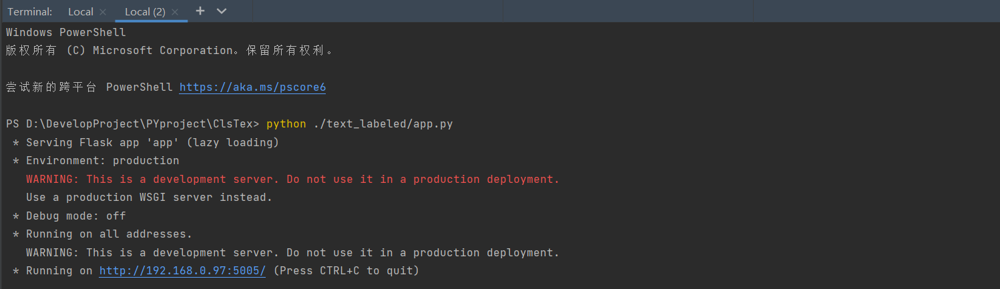
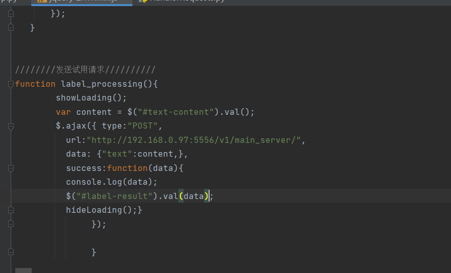
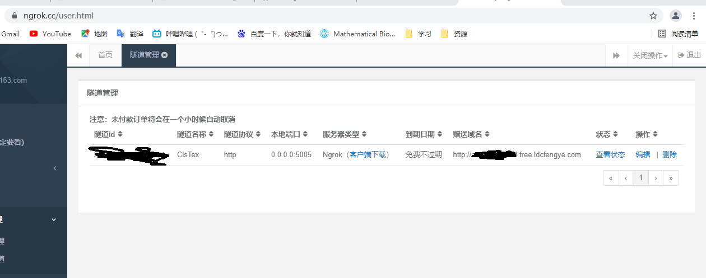
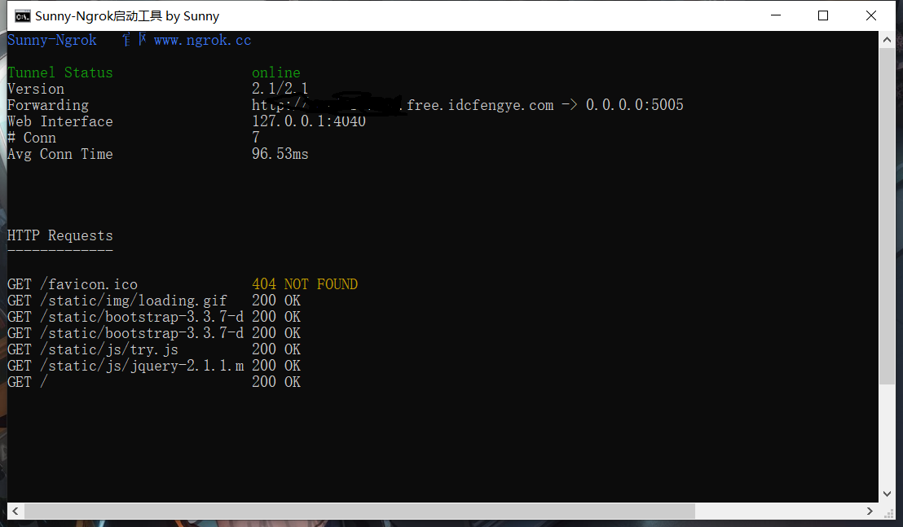
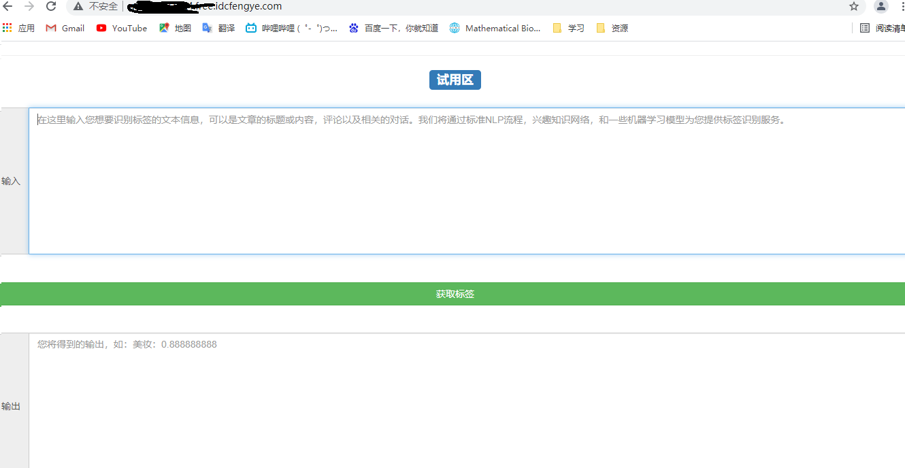
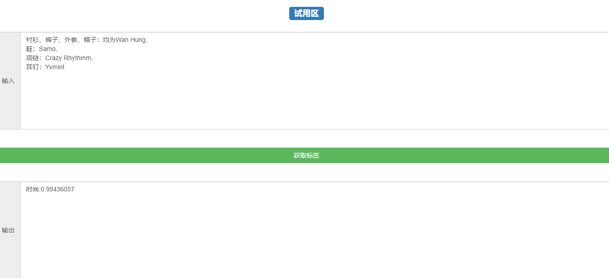

# 	ClsTex

* 智能文本分类

## 部署环境

* 操作系统
  * Windows 10
  
  * CentOS 8.3
* 主要框架
  * tesorflow 2.3.0
  * flask 2.0.1

以下操作在不同的操作系统下通用，文件读取路径按照各自的环境进行更改即可，主要更改model_config.json文件。

## 1、部署用于文本分类的深度学习模型


```shell
python ./text_labeled/model_train/HandlerRequests.py
```



## 2、部署前端页面服务

``` shell
python ./text_labeled/app.py
```



## 3、深度学习模型的服务通过Ajax进行调取



## 4、使用Ngrok进行内网穿刺进行本地项目部署





## 5、通过Ngrok的域名访问前端页面



## 6、进行深度学习模型的调用



## 7、 优化

后续可以把深度学习模型以web服务的形式独立于具体应用进行部署。

